# ☀️ PV + Battery Curtailment Analysis Tool

**Professional 15-minute resolution energy systems modeling**  
7 physically-correct BESS strategies • Full 4-scenario framework • Capacity sensitivity • Automated DOCX reporting

[](https://www.python.org/)
[](https://plotly.com/)
[](https://python-docx.readthedocs.io/)

---

## 🎯 Executive Summary — Real-World Impact

**Site**: UW Teufenbach, Austria  
**PV Capacity**: ~10.16 MW DC  
**Grid Injection Limit**: 9 MW  
**Battery**: 4.3 MWh / 2.16 MW (Huawei LUNA2000-215-2S10 × 20)  
**Resolution**: 15-minute (35,040 intervals/year)  
**Period**: Full calendar years 2024 & 2025

### Headline Results (Best Performing Strategies)

| Year | Baseline Curtailment (S1) | With 4.3 MWh BESS (S3) | **Energy Saved** | Curtailment Reduction | Battery Cycles |
|------|---------------------------|------------------------|------------------|-----------------------|----------------|
| **2024** | 6,110 MWh (**14.1%**)    | 5,188 MWh (**12.0%**) | **+922 MWh**    | **2.1 percentage points** | ~196 |
| **2025** | 5,924 MWh (**14.1%**)    | 5,016 MWh (**12.0%**) | **+908 MWh**    | **2.1 percentage points** | ~193 |

> A modest 4.3 MWh battery recovers **~910–922 MWh per year** — approximately **15% of the energy lost** to the grid limit.

---

## 📊 Visual Gallery — Publication-Quality Outputs

### Capacity Sensitivity Analysis (Diminishing Returns)

**2025**
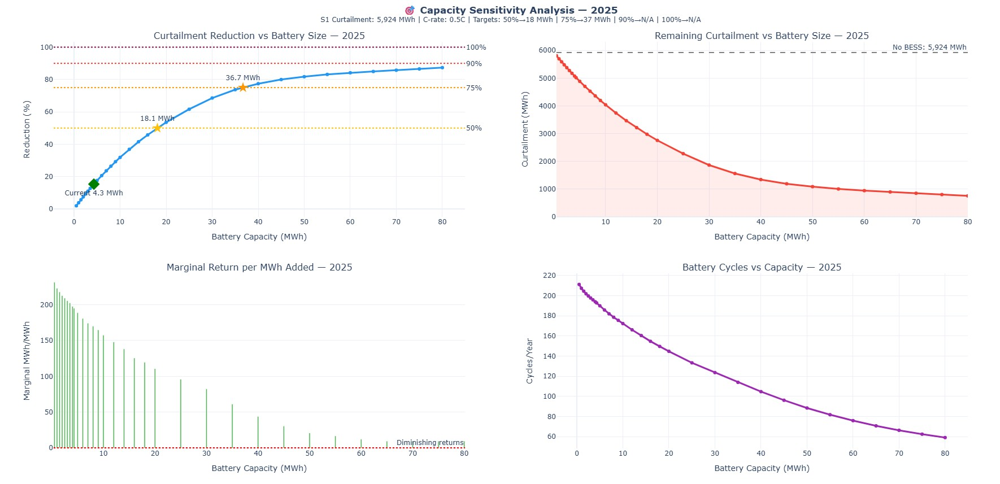

**2024**
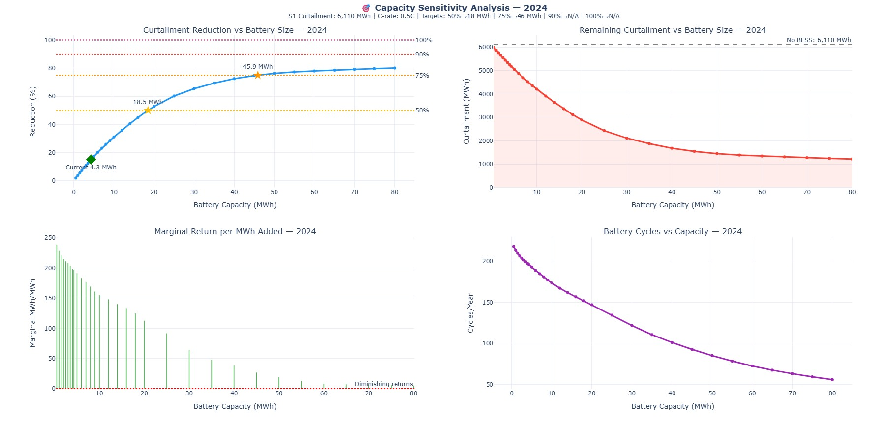

**Cross-Year Sizing Recommendations (0.5C, Peak Shaving strategy)**

| Curtailment Reduction Target | Average Battery Size Required | Investment Scale |
|------------------------------|-------------------------------|------------------|
| 50%                         | ~18.2 MWh / 9.1 MW           | ~4.2× current battery |
| 75%                         | ~41 MWh / 20.5 MW            | Major capital project |
| 90%+                        | Not achievable (≤80 MWh)     | Strong diminishing returns after ~20–25 MWh |

### Strategy Performance Ranking (Consistent Across Both Years)

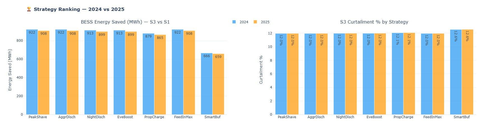

**Performance tiers**:
- **Top tier**: Peak Shaving, Aggressive Discharge, Feed-in Maximization
- **Mid tier**: Night Discharge, Evening Boost
- **Lower tier**: Proportional Charge
- **Worst**: Smart Buffer (15% SOC reserve reduces effectiveness)

### Full 4-Scenario Energy Balance

**2025**
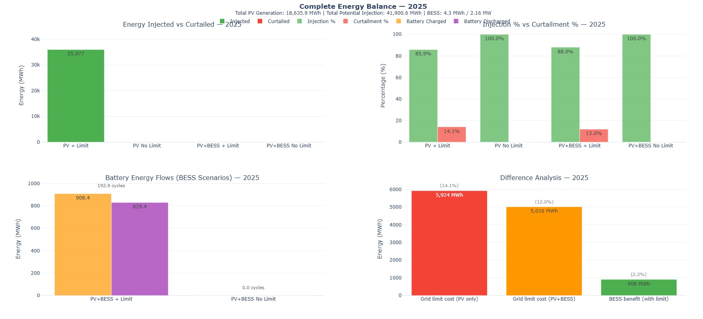

**2024**
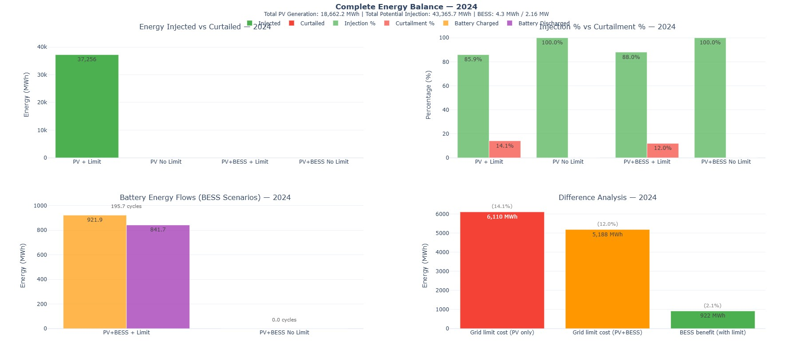

### 4-Scenario Comparison Dashboards

**2025**
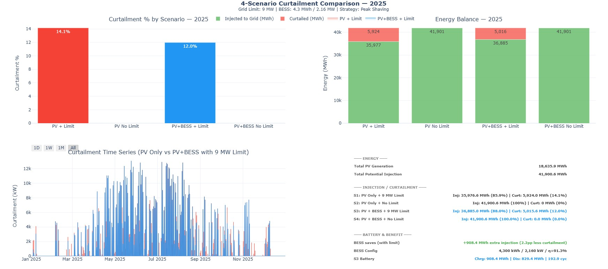

**2024**
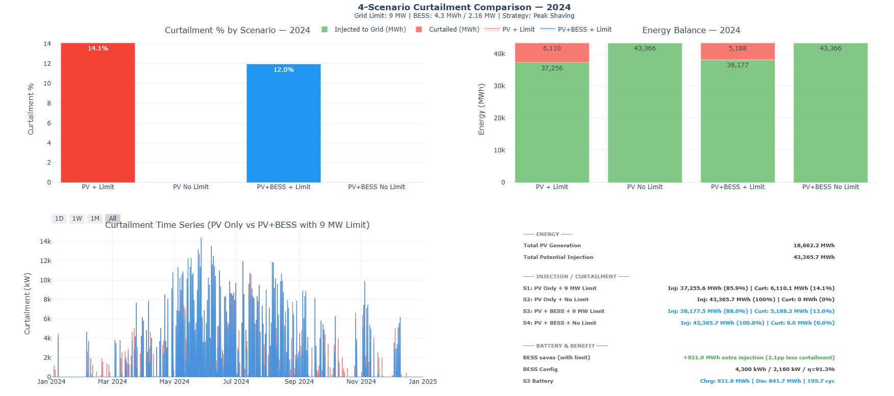

### Monthly Curtailment & Detailed Strategy Comparison

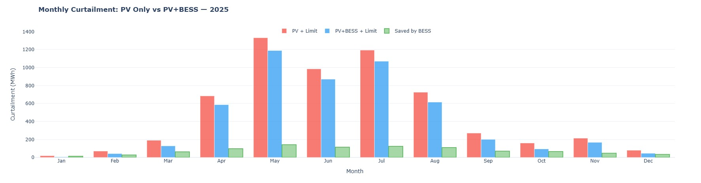 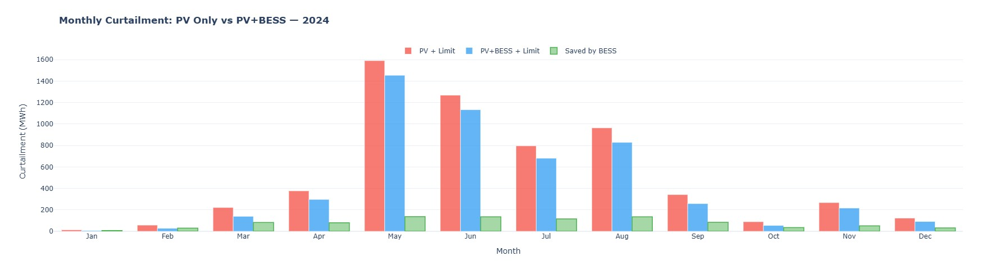

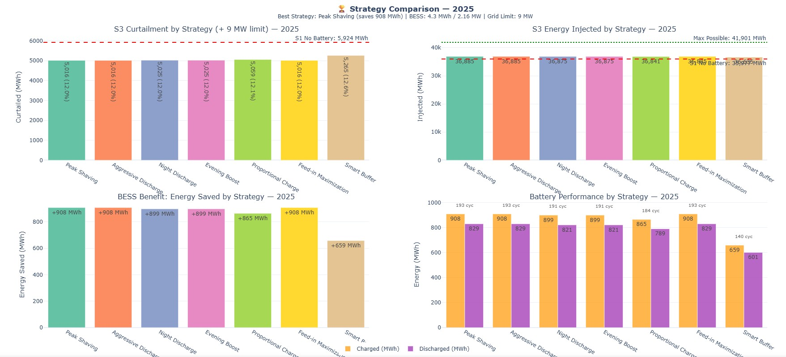 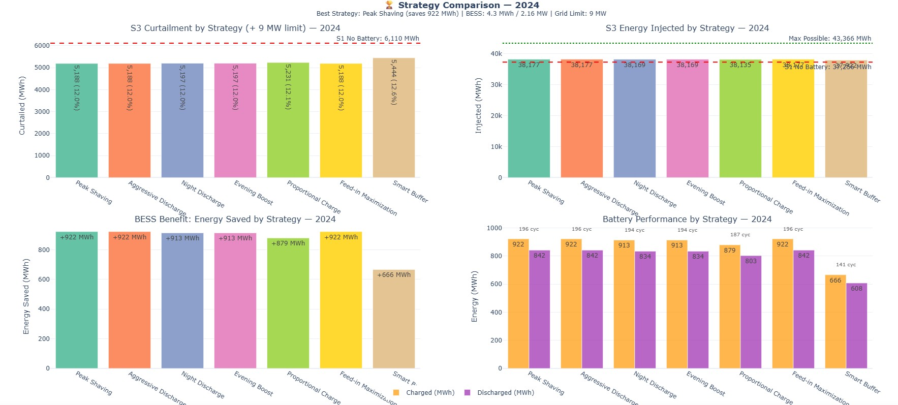

### Production-Ready GUI

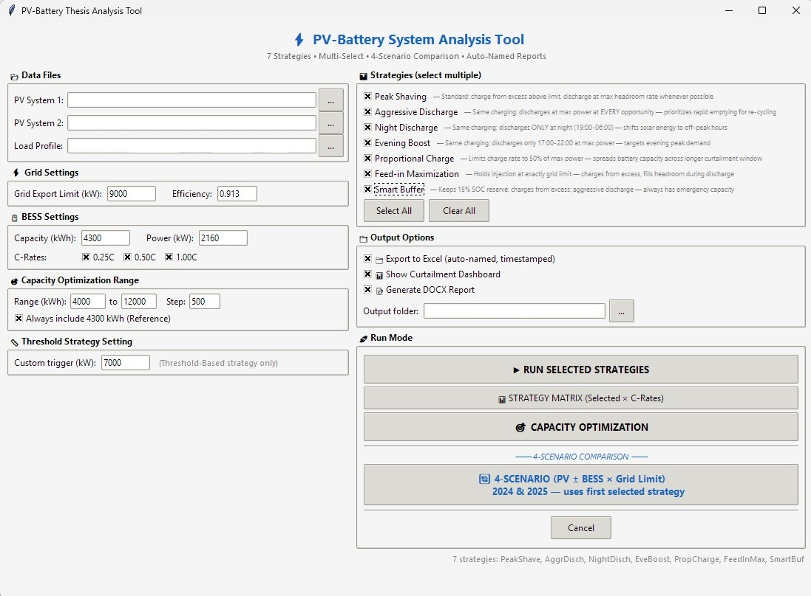

---

## 🧠 Technical Highlights

### 1. Physically Rigorous Battery Modeling
- Battery **only charges from curtailed energy** (excess above grid limit)
- Discharge is **impossible** when `Net_Injection ≥ Grid Limit`
- Correct round-trip efficiency (91.3%) applied per direction
- Realistic modeling of long continuous curtailment windows

### 2. Seven Production-Grade Strategies
All strategies follow the same strict charging rule. Only discharge timing and rate differ.

### 3. Full 4-Scenario Framework
- **S1**: PV + 9 MW limit (current reality)
- **S2**: PV + No Limit (theoretical maximum)
- **S3**: PV + BESS + 9 MW limit (practical value of storage)
- **S4**: PV + BESS + No Limit (arbitrage-only mode)

### 4. Capacity Sensitivity + Actionable Sizing
Automated sweeps with interpolation to determine battery sizes needed for 50/75/90/100% curtailment reduction targets, with cross-year averaging.

### 5. Professional Deliverables
- Interactive Plotly dashboards with range selectors
- Timestamped, multi-sheet Excel exports
- Complete DOCX technical report with embedded figures and tables

---

## 🚀 Quick Start

```bash
pip install pandas numpy plotly python-docx kaleido openpyxl
python pv_battery_Curtailment_V28.py
```

Update the file paths at the top of the script for your PV and load data.

**Recommended workflow**:
1. Run **4-SCENARIO COMPARISON** (multi-select strategies)
2. Review interactive plots + generated DOCX report
3. Run **CAPACITY SENSITIVITY** for sizing recommendations

---

## 📁 Project Structure (Recommended)

```

pv-battery-curtailment/
├── README.md
├── requirements.txt
├── pv_battery_Curtailment_V28.py          # ← main Python script
│
├── images/                                # ← ALL CHARTS & SCREENSHOTS 
│   ├── capacity_sensitivity_2024.jpg
│   ├── capacity_sensitivity_2025.jpg
│   ├── strategyranking.jpg
│   ├── complete_2024.jpg
│   ├── complete_2025.jpg
│   ├── 4_Scenario_Curtailment_Comparison_2024.jpg
│   ├── 4_Scenario_Curtailment_Comparison_2025.jpg
│   ├── Monthly_2024.jpg
│   ├── Monthly_2025.jpg
│   ├── stretagy_2024.jpg
│   ├── stretagy_2025.jpg
│   └── PV-Battery_Analysis_Tool.jpg
│
├── data/                                  # ← input data files
│   ├── pvsyst_pv1.csv
│   ├── pvsyst_pv2.csv
│   └── Lastprofil_2024_2025.xlsx
│
├── outputs/                               #  Generated reports (can be gitignored)
│
└── .gitignore

```


The current implementation is a single well-organized Python file for simplicity.  
For larger projects it can easily be refactored into modules (`data/`, `battery/`, `visualization/`, `reporting/`).

---

## 📦 Code Availability

The full source code is **not publicly released**.

The code **can be shared upon request** for academic collaboration, research partnerships, or commercial licensing discussions.

Please contact the author via GitHub or email if you are interested.

---

## 📁 Generated Artifacts

- `4Scenario_*.xlsx` — Full energy balance for both years
- `StrategyComparison_*.xlsx` — All 7 strategies ranked side-by-side
- `PV_BESS_Curtailment_Report_*.docx` — Complete thesis-ready technical report
- High-resolution interactive Plotly visualizations

---

## ⚠️ Limitations (Full Transparency)

- No battery degradation, temperature, or calendar aging modeled
- Multi-cycling is naturally limited by long continuous summer curtailment periods
- Results are specific to this site’s load shape and solar resource
- Achieving >75–80% curtailment reduction requires impractically large batteries

---

## 🏆 Why This Stands Out

Most academic PV+BESS curtailment studies use simplified battery logic, analyze only one year, and test 1–3 strategies.

**This work**:
- Enforces strict physics
- Evaluates 7 strategies across 2 full years
- Quantifies diminishing returns with sensitivity analysis
- Delivers publication-ready figures + automated reporting
- Clearly demonstrates that **strategy choice matters** (hundreds of MWh/year difference)

---

**Developed as part of a Master's thesis using real Austrian 15-minute substation data.**  
High-quality, reproducible energy systems analysis with top-tier visualization and documentation.

**GitHub**: [AIMLDS7](https://github.com/AIMLDS7)

---

*Analysis performed with real 15-minute Austrian grid data • June 2026*
